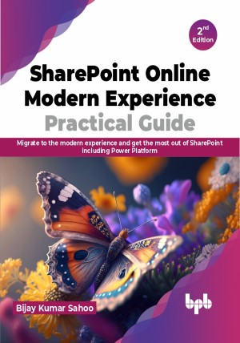

# SharePoint Online Modern Experience Practical Guide - 2nd Edition

How to make the most of a career in new technology by utilizing SharePoint technology, including Power Platform

This is the repository for [SharePoint Online Modern Experience Practical Guide - 2nd Edition
](https://bpbonline.com/products/sharepoint-online-modern-experience-practical-guide-2nd-edition?_pos=1&_sid=952d30966&_ss=r&variant=43042540159176),published by BPB Publications.

## About the Book
SharePoint Online Modern Experience Practical Guide, 2nd Edition is a comprehensive guide that will teach you everything you need to know about SharePoint Online Modern Experience. The book begins by covering the benefits of using SharePoint Online Modern Experience, creating and managing modern team sites and communication sites, and customizing modern site pages. You will further learn about the types of modern lists and document libraries, and how to create and manage them.

Then, you will learn about Power Platform, how to use it with SharePoint Online to improve communication and collaboration. You will also understand how to streamline document management, and increase productivity. Further, Power Apps, Power Automate, and Power BI, and how to use them to automate tasks, create reports, and visualize data will be discussed.

In the end, you will learn about advanced topics related to SharePoint Online Modern Experience, such as the SharePoint Framework and how to develop client-side web parts. You will gain insights into various methods to deploy SharePoint Online Modern Experience solutions, manage and monitor them. You will into various methods for implementing SharePoint Online Modern Experience solutions, as well as how to oversee and track their management.

## What You Will Learn
• What SharePoint Online Modern Experience is and how it can benefit your organization.

• How to create and manage modern team sites and communication sites.

•  How to customize modern site pages and web parts.

•  How to use modern lists and document libraries to store and manage your content.

•  How to use the Power Platform with SharePoint Online to automate tasks, create reports, and visualize data.

•  Use SharePoint Framework to build a client site model.

